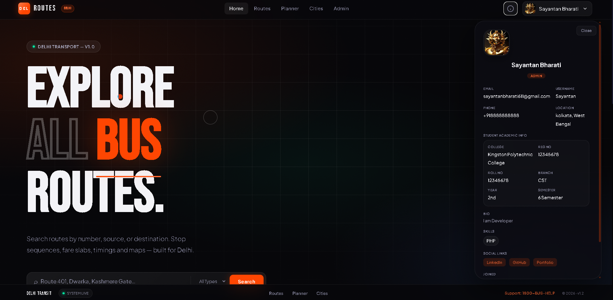
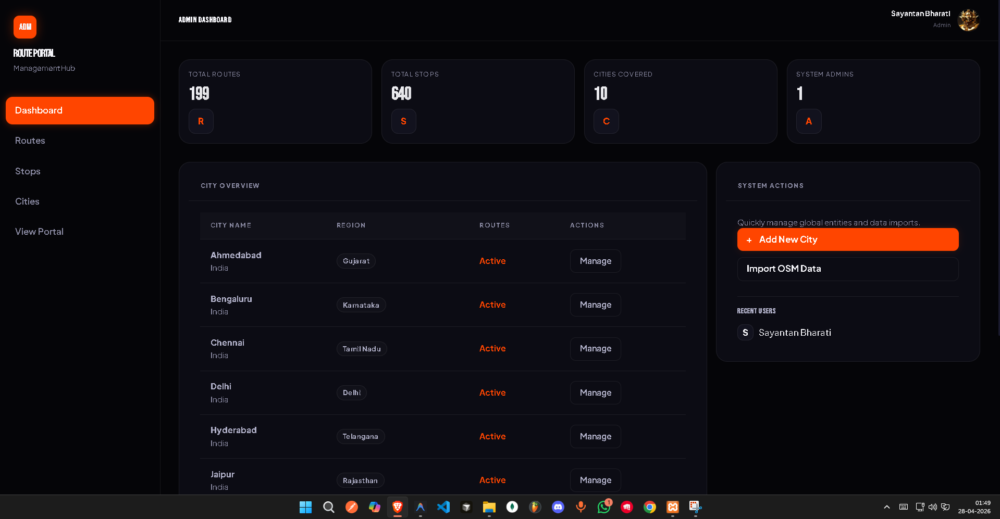
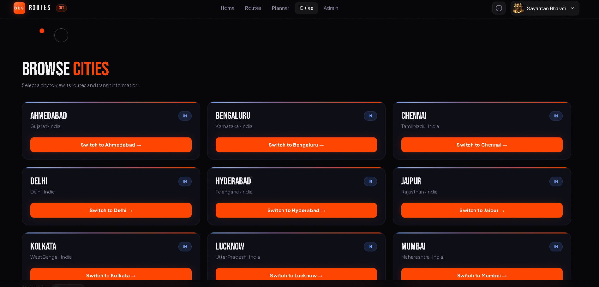
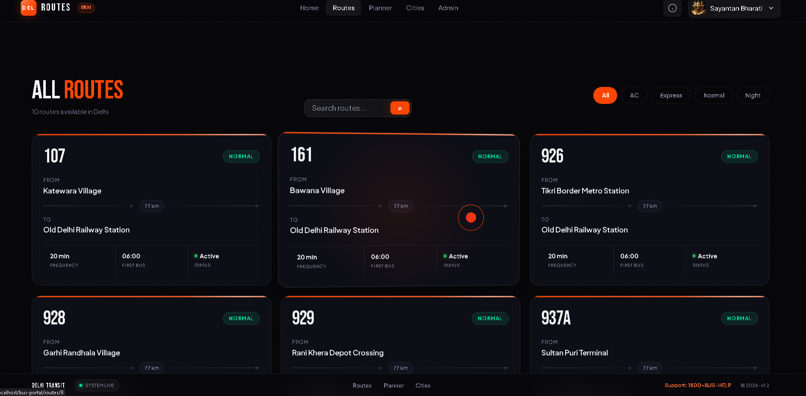
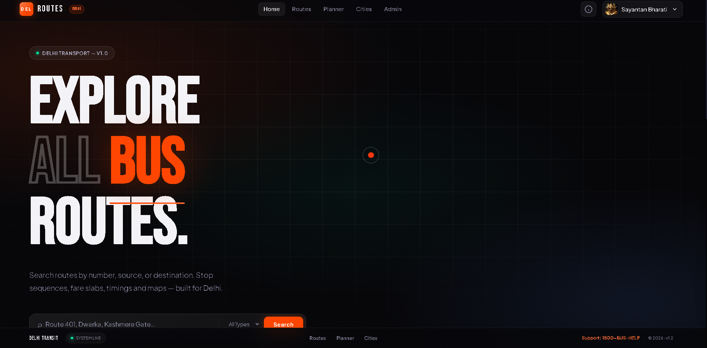

# Universal City Bus Route Portal (v3.0)
### High-Performance Multi-City Transit Management System

**Live Demo: [https://yatrapath.gt.tc/](https://yatrapath.gt.tc/)**

A premium, industrial-grade bus information and management system built with Core PHP (MVC) and MySQL. Featuring a state-of-the-art dark aesthetic, real-time GIS integration, and a comprehensive administrative suite.


---

## Key Features

- **Multi-City Architecture**: Seamlessly manage transit networks for multiple cities (Delhi, Kolkata, Mumbai, etc.) with localized currencies, timezones, and map centers.
- **Advanced Route Management**:
  - Detailed route sequencing with stop-by-stop distance tracking.
  - Multi-tier fare slabs (General, Student, Senior) per route.
  - Support for multiple route types (AC, Express, Normal, Night, Mini).
- **Premium UI/UX**:
  - Industrial Dark Aesthetic: Glassmorphism, neon accents, and noise textures.
  - Interactive Elements: 3D tilt route cards, custom animated cursors, and reveal-on-scroll animations.
  - Mobile Responsive: Fully optimized for all device sizes (Audit v3.0).
- **GIS & Mapping**: Leaflet.js integration with OpenStreetMap (Dark Matter) for real-time stop visualization and route paths.
- **Secure Administration**:
  - Hybrid Auth: JWT-based sessions combined with Google OAuth 2.0.
  - Role-Based Access: Admin, Editor, and Viewer permissions.
  - Activity Logging: Comprehensive tracking of all administrative actions.
- **Performance**: PDO Singleton patterns, optimized SQL queries, and zero-dependency frontend logic.

---

## Tech Stack

- **Backend**: Core PHP 8.2 (MVC Architecture), PDO, JWT, Composer.
- **Frontend**: HTML5, Vanilla CSS (Modern Industrial), ES6+ JavaScript.
- **Database**: MySQL 8.0 / MariaDB.
- **Mapping**: Leaflet.js, OSM API.
- **Design Reference**: Based on high-fidelity reference.html industrial system.

---

## Database Schema Overview

The system runs on a highly relational schema optimized for transit efficiency:

| Table | Description |
| :--- | :--- |
| cities | Localized city metadata (lat/lng, currency, timezone). |
| routes | Transit routes with timing, distance, and type categorization. |
| stops | Geographical stop points with landmark and zone data. |
| route_stops | Mapping table for route sequencing and arrival offsets. |
| fares | Dynamic fare calculation slabs based on distance and passenger type. |
| users | Comprehensive profiles (30+ fields) with role-based auth. |
| activity_log | Detailed audit trail of all system changes. |

---

## Installation & Setup

Follow these steps to get the portal running on your local machine:

### 1. Prerequisites
- **XAMPP / WAMP** with PHP 8.1+ and MySQL 8.0+.
- **Composer** installed globally.
- **Google Cloud Console** credentials (for OAuth features).

### 2. Clone & Install
```bash
git clone https://github.com/Sayantan-B-dev/Lv3_YatraPath.git
cd yatrapath
composer install
```

### 3. Environment Configuration
Copy the example environment file and update your credentials:
```bash
cp .env.example .env
```

#### Detailed Environment Variables (.env)

| Variable | Description | Example / Default |
| :--- | :--- | :--- |
| `APP_NAME` | Name of the application | "Bus Route Portal" |
| `APP_ENV` | Environment mode | `development` or `production` |
| `APP_URL` | Base URL of the project | `http://localhost/yatrapath` |
| `APP_SECRET` | 32-char key for encryption | `random_string_here` |
| `DB_HOST` | Database server host | `localhost` |
| `DB_PORT` | Database server port | `3306` |
| `DB_NAME` | Name of the database | `yatrapath` |
| `DB_USER` | Database username | `root` |
| `DB_PASS` | Database password | `your_password` |
| `GOOGLE_CLIENT_ID` | Google OAuth Client ID | `xxx.apps.googleusercontent.com` |
| `GOOGLE_CLIENT_SECRET`| Google OAuth Client Secret | `your_client_secret` |
| `GOOGLE_REDIRECT_URI` | OAuth callback URL | `APP_URL/auth/google/callback` |
| `JWT_SECRET` | Secret key for JWT signing | `another_random_string` |
| `JWT_EXPIRY` | JWT token validity in seconds | `3600` |
| `MAPTILER_API_KEY` | API Key for MapTiler tiles | `your_maptiler_key` |

### 4. Database Import
1. Open **phpMyAdmin** and create a database named `yatrapath`.
2. Import the latest master SQL file:
   - `database/master_dump.sql` (Contains full schema + optimized seed data for 10+ Indian cities).

### 5. Web Server Configuration
Ensure Apache `mod_rewrite` is enabled. Point your virtual host or DocumentRoot to the root directory. If using XAMPP:
- Navigate to `http://localhost/yatrapath/`

---

## Administrative Access

To access the management dashboard:
1. Navigate to `/auth/login` or click **Admin Panel** in the nav.
2. Sign in via Google.
3. If your email is registered as an `admin` in the `users` table, you will gain access to:
   - **Cities**: Manage operating regions.
   - **Stops**: Update coordinates and landmarks.
   - **Routes**: Edit paths, timing, and fare slabs.

---

## Mobile Support
The project recently underwent a Global Responsiveness Audit (v3.0). All components including the 3D cards, admin tables, and complex profile forms are fully functional on iOS and Android devices.

## Screenshots






---
*Built for Modern Urban Transit.*
